# GraphQL NewsApi 

###### TechNews app using GraphQL & [News API](https://newsapi.org).

### BRANCH

- [main](https://github.com/MKS-01/GraphQL-NewsApi) - mock data
- [NoSQL-mongoDB](https://github.com/MKS-01/GraphQL-NewsApi/tree/NoSQL-mongoDB)

### CLIENT

Mobile [Setup Guide](https://github.com/MKS-01/GraphQL-NewsApi/tree/main/client/mobile)

### SERVER

[Setup Guide](https://github.com/MKS-01/GraphQL-NewsApi/blob/main/server/README.md)

#### 📝 [CHECKLIST](TODO.md)

### INITIAL WIREFRAME

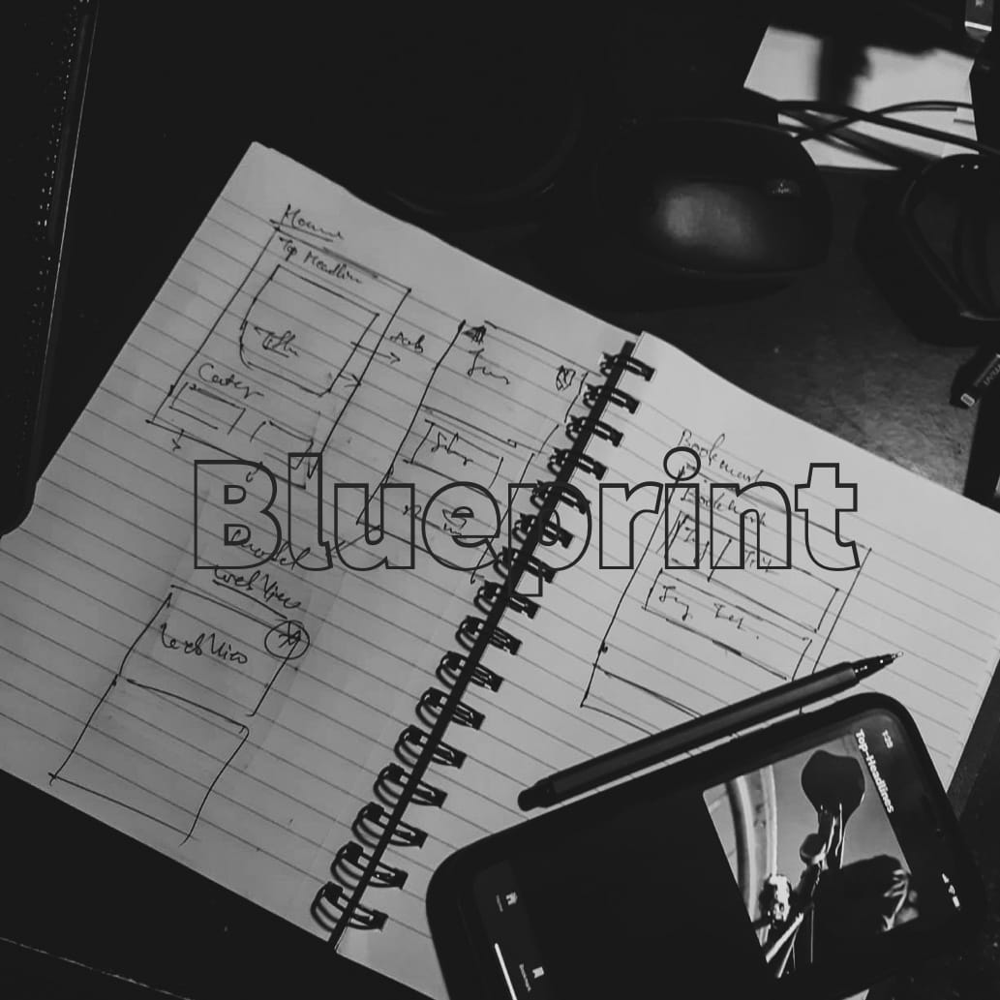
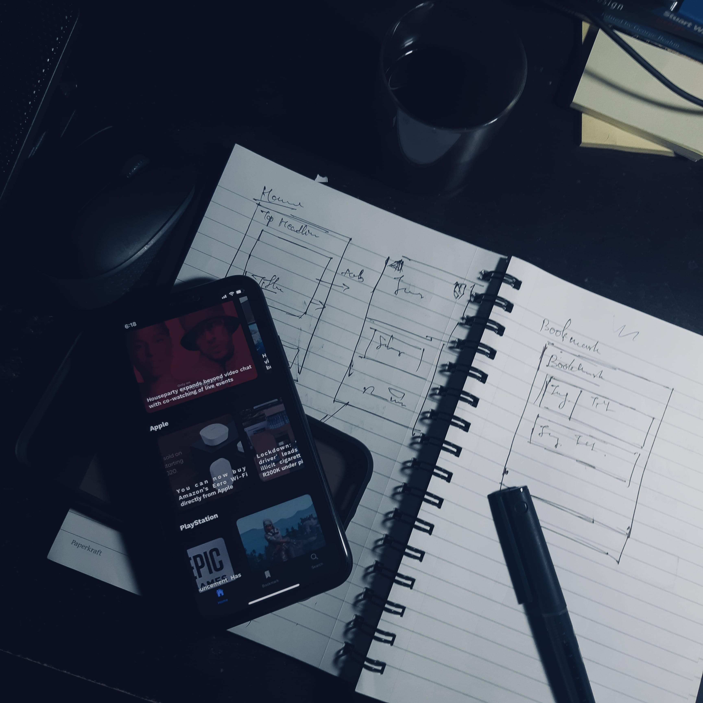

### SCREENSHOTS

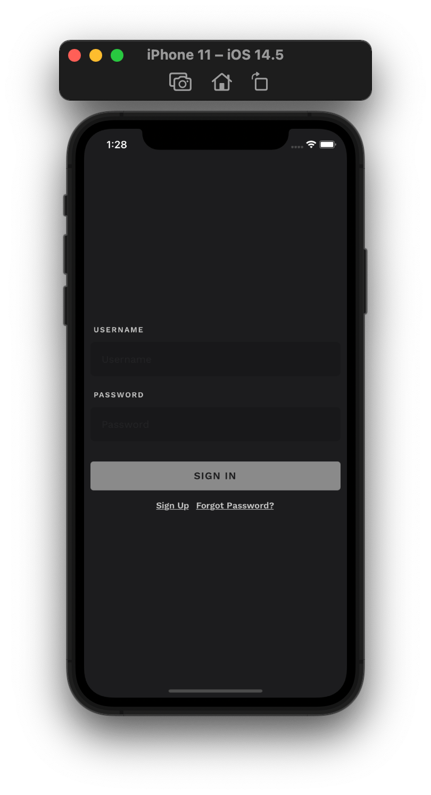
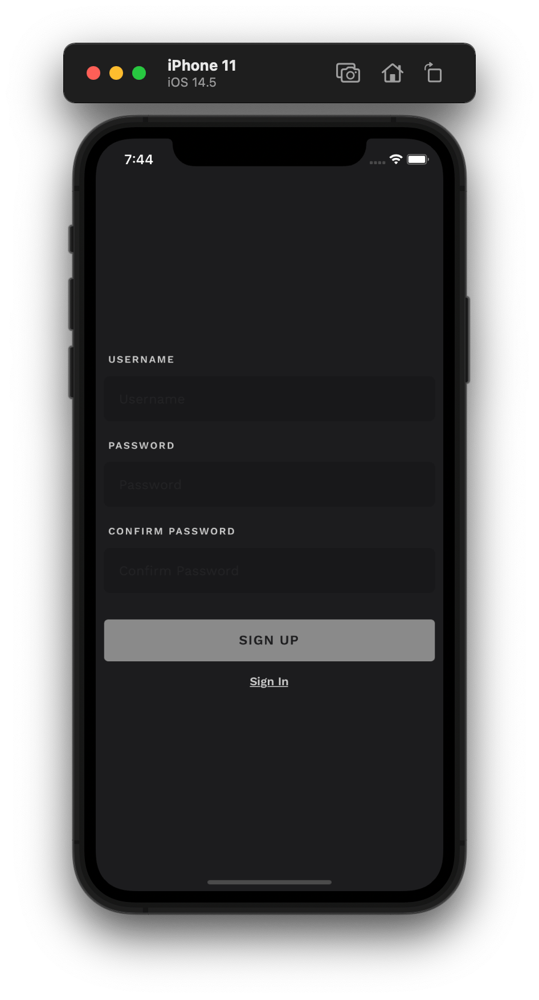
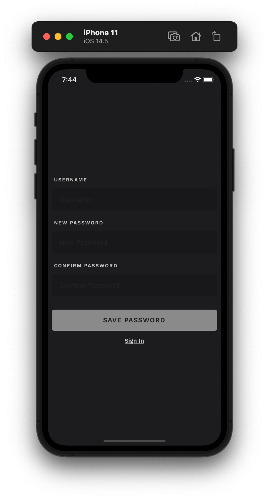

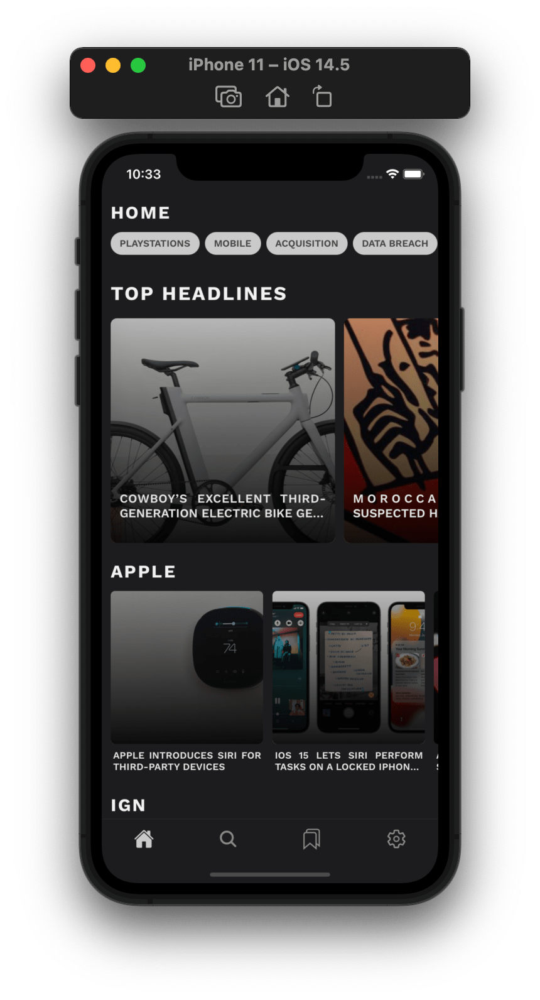
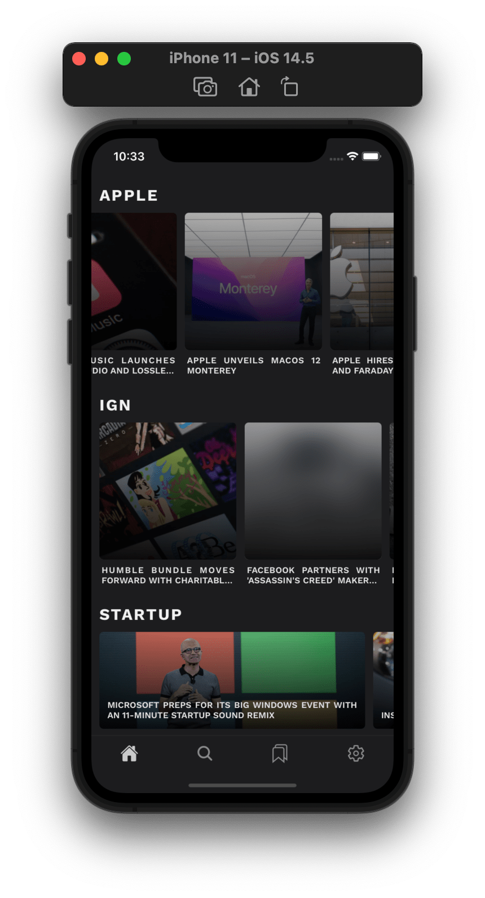
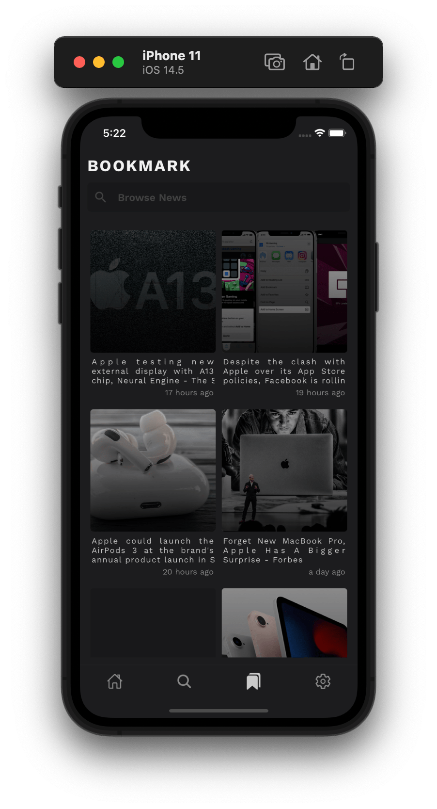

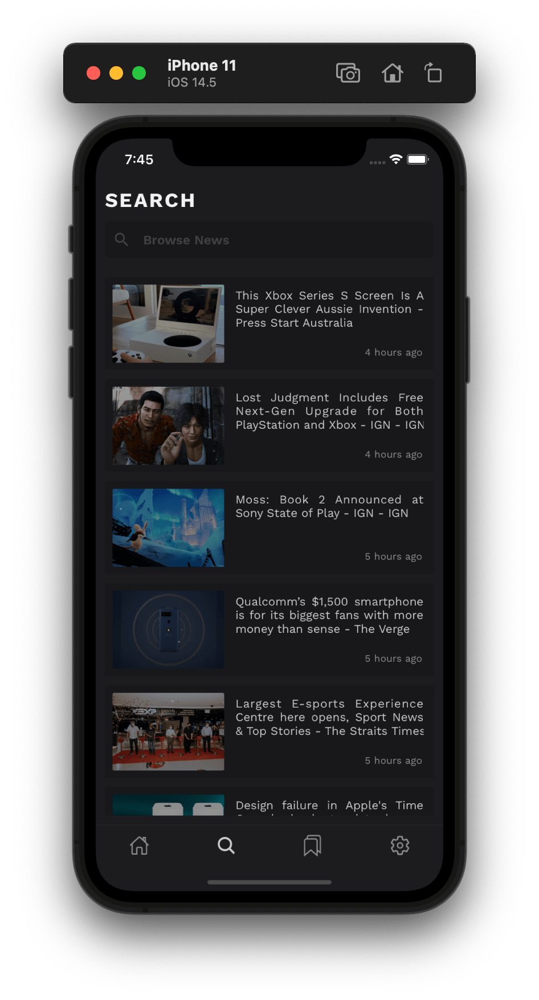
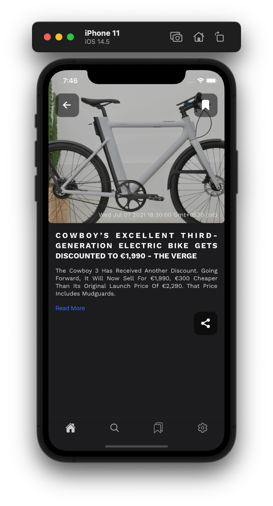
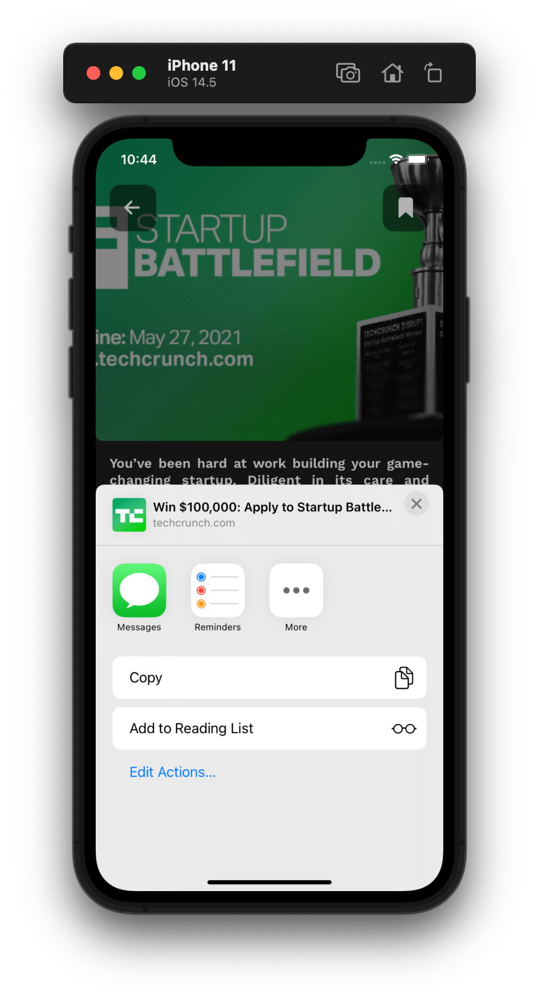

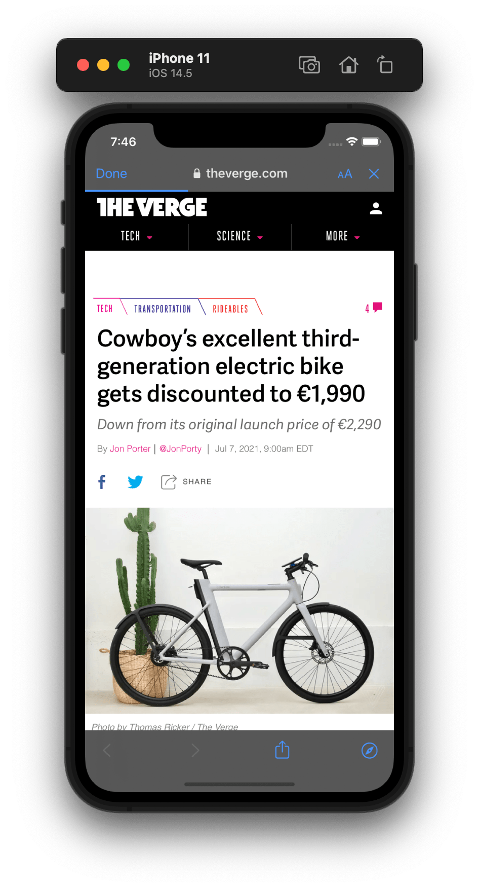
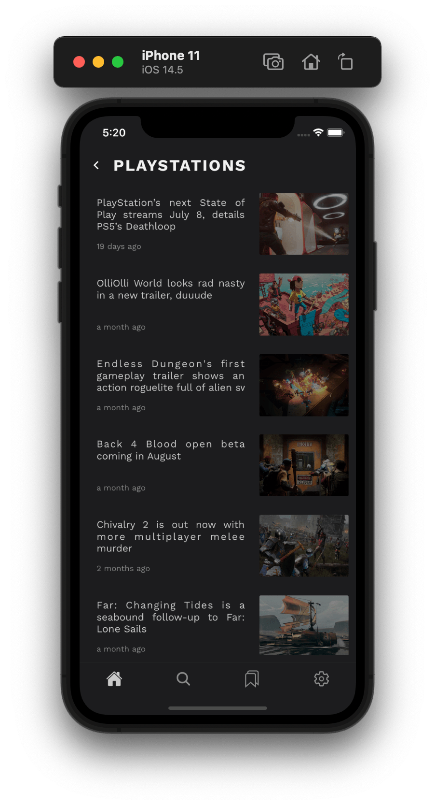
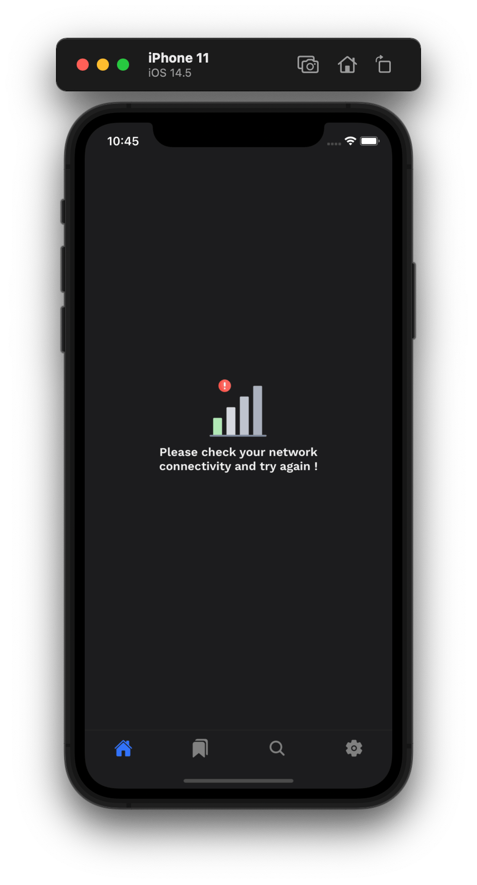

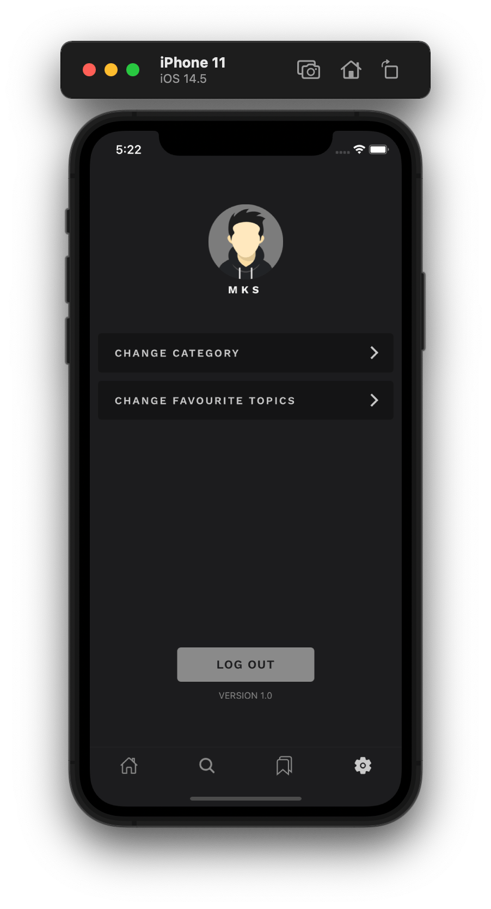

