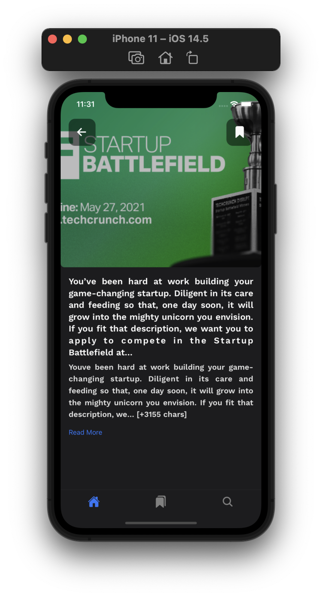

# GraphQL-Practice

A simple TechNews app using GraphQL & [News API](https://newsapi.org). To practice latest features of GraphQL. As well practice [React Native's Animated library](https://github.com/software-mansion/react-native-reanimated).

###### Concept Covers:

- Auth Using JWT
- Pagination
- Optimise Search
- Animation on client side.
- App running @60FPS

#### CLIENT

###### Tech Stack

- Expo (React-Native) - JavaScript
- GraphQL Client - [Apollo Client](https://github.com/apollographql/apollo-client)
- CSS - [Styled-Components](https://styled-components.com)

#### SERVER

###### Tech Stack

- Node.js
- [Apollo Server](https://github.com/apollographql/apollo-server)
- DB - Postgres
- ORM - [Prisma](https://github.com/prisma/prisma)
- Docker

### EXPO

